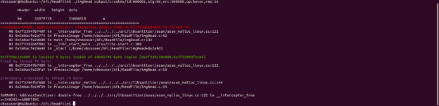

## **1. Introduction**
This technical documentation outlines the procedures and methods utilized for fuzzing software applications using one prominent tool: American Fuzzy Lop (AFL). Fuzzing is a powerful testing technique that involves injecting invalid, malformed, or unexpected inputs into a program to identify software defects and vulnerabilities. This document details the setup, execution, and results of fuzzing experiments conducted on the Damn Vulnerable C Program (DVCP) with AFL.
## **2. Tool Setup**
### **2.1 Setting Up AFL**
**Step 1: Install Required Dependencies**

Before installing AFL, open your terminal and ensure the following dependencies are installed:

sudo apt update
sudo apt install build-essential python3 git

**Step 2: Download and Install AFL**

Clone the AFL repository from GitHub and compile it:

git clone [https://github.com/google/AFL.git
](https://github.com/google/AFL.git)cd AFL
make

**Step 3: Verify Installation**

To confirm that AFL is installed correctly, run the following command:

./afl-fuzz -V

**Screenshot 1:** AFL Installation Verification 

## **3. Experimental Procedures**
### **3.1 Fuzzing with AFL on the Damn Vulnerable C Program (DVCP)**
**Step 1: Download the DVCP**

Clone the DVCP repository:

git clone [https://github.com/hardik05/damn_vulnerable_c_program.git
](https://github.com/hardik05/Damn_Vulnerable_C_Program.git)cd damn-vulnerable-c-program

**Step 2: Compile DVCP with AFL**

To instrument DVCP for fuzzing, compile it using AFL's compiler wrapper:

make CC=afl-gcc
**Step 3: Harden and sanitize the imgRead.c file**

*AFL\_HARDEN=1 afl-gcc –fsanitize=address –fomit-framepointer –fsanitize=undefined imgRead.c -o imgRead*

- AFL\_HARDEN=1: This environment variable enables hardened instrumentation, which helps detect buffer overflows and other common vulnerabilities, making the fuzzing process more effective.
- afl-gcc: AFL’s wrapper around gcc (GNU Compiler Collection) that includes AFL’s instrumentation, allowing it to monitor and gather feedback on code paths taken during fuzzing.
- -fsanitize=address: This flag enables AddressSanitizer, which detects memory errors like buffer overflows, use-after-free errors, and other memory-related issues.
- -fomit-frame-pointer: This flag omits the frame pointer in functions to optimize performance. It is optional here, as AddressSanitizer typically requires the frame pointer to be retained for effective stack tracing, so you may choose to omit it.
- -fsanitize=undefined: This flag enables UndefinedBehaviorSanitizer, which detects undefined behavior (e.g., integer overflows, shifts by an invalid amount, and invalid pointer dereferences).
- imgRead.c -o imgRead: Compiles the source file imgRead.c into an executable named imgRead.

**Step 4: Prepare Input Files**

Create a directory for input and output and place initial test case inside:

mkdir input output
echo "IMG" > input/1.txt

**Step 4: Run AFL Fuzzer**

Start the AFL fuzzer with the compiled DVCP binary:

Afl-fuzz –i input –o output –m none -- ./imgRead @@

- afl-fuzz: This is the main fuzzing tool in AFL that performs automated testing to identify vulnerabilities and crashes.
- -i input: Specifies the input directory where AFL will find the initial test cases to start the fuzzing process. Replace input with the path to a directory containing sample files that imgRead can process.
- -o output: Specifies the output directory where AFL will store results, including crash and hang cases, test case coverage, and other metrics. Replace output with your desired output directory path.
- -m none: This disables memory limits, allowing imgRead to run with no restrictions on memory. While useful for programs with variable memory needs, it can be risky if imgRead has high memory demands, so you may want to set a limit (e.g., -m 100 for 100 MB).
- --: This double dash tells AFL that everything following it is the command to run the target program. This is useful for avoiding conflicts with AFL's own options.
- ./imgRead @@: Specifies the path to the executable imgRead and uses @@ as a placeholder. AFL replaces @@ with the path to each generated test case, running imgRead with these test files.

**Screenshot 3:** Running AFL Fuzzer 

**Step 5: Monitor Fuzzing Process**

- AFL provides a real-time, interactive display that shows key metrics during fuzzing. Start afl-fuzz in a new terminal window to view:
- **Paths**: Unique execution paths discovered.
- **Cycles Done**: Number of completed cycles through the test cases.
- **Stability**: How reliably the program behaves with the test cases.
- **Pending**: Number of test cases yet to be executed.
- **Crashes and Hangs**: Counts of unique crashes and hangs found.

## **4. Results**
This section summarizes the vulnerabilities identified through the fuzzing processes:

**Crash 1 Results:**

**Screenshot:**  Crash 1 Integer Overflow Result

**Crash 2 Results:**

**Crash 3 Results:**

**Crash 4 Results:**

**Crash 5 Results:**

**Crash 6 Results:**

**Crash 7 Results:**

## **5. Conclusion**
This technical documentation outlines the installation, setup, and execution of fuzzing techniques using AFL on Ubuntu. The experiments conducted on the DVCP highlighted the effectiveness of AFL in uncovering software vulnerabilities, thus reinforcing the importance of fuzzing in enhancing software security practices.
## **6. References**
Gentle, J. (n.d.). Bug hunting with American Fuzzy Lop. Joseph Gentle’s Blog. https://josephg.com/blog/bug-hunting-with-american-fuzzy-lop/ 

Boehme, M., Cadar, C., & Roychoudhury, A. (2021). Fuzzing: Challenges and reflections. IEEE Software, 38(3), 79-86. https://doi.org/10.1109/MS.2020.3016773 

Gutmann, P. (2016). Fuzzing code with AFL. Login Usenix Magazine, 41, 11-14. 

Kersten, R., Luckow, K., & Păsăreanu, C. S. (2017). Poster: AFL-based fuzzing for Java with Kelinci. In Proceedings of the 2017 ACM SIGSAC Conference on Computer and Communications Security (pp. 2511–2513). Association for Computing Machinery. <https://doi.org/10.1145/3133956.3138820>

Li, J., Zhao, B., & Zhang, C. (2018). Fuzzing: A survey. Cybersecurity, 1(6). <https://doi.org/10.1186/s42400-018-0002-y> 

Sharma, A., Cadar, C., & Metzman, J. (2024). Effective fuzzing within CI/CD pipelines (Registered Report). In Proceedings of the 3rd ACM International Fuzzing Workshop (FUZZING 2024) (pp. 52–60). Association for Computing Machinery. <https://doi.org/10.1145/3678722.3685534> 

Zhang, J., Li, W., Chen, Y., & Liu, X. (2023). Learning seed-adaptive mutation strategies for greybox fuzzing. Proceedings of the 2023 IEEE Symposium on Security and Privacy, 12–19. <https://doi.org/10.1109/10172576>

Li, M., Zhou, F., Yang, T., & Zhang, S. (2023). FMUZZ: A novel greybox fuzzing approach based on mutation strategy optimization with byte scheduling. Proceedings of the 2023 IEEE Conference on Dependable Systems and Networks, 45–52. <https://doi.org/10.1109/10684673>

<https://github.com/hardik05/Damn_Vulnerable_C_Program/tree/master?tab=readme-ov-file>

